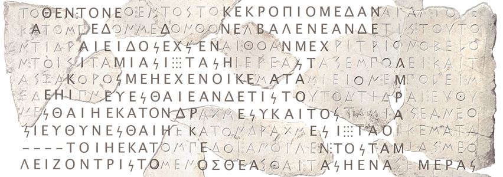
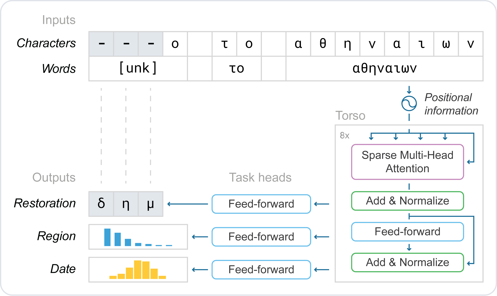

<p align="center" style="margin-bottom:1em;" >

</p>

# Restoring and attributing ancient texts using deep neural networks

Yannis Assael<sup>1,\*</sup>, Thea Sommerschield<sup>2,3,\*</sup>, Brendan Shillingford<sup>1</sup>, Mahyar Bordbar<sup>1</sup>, John Pavlopoulos<sup>4</sup>,
Marita Chatzipanagiotou<sup>4</sup>, Ion Androutsopoulos<sup>4</sup>, Jonathan Prag<sup>3</sup>, Nando de Freitas<sup>1</sup>

*<sup>1</sup> DeepMind, United Kingdom<br/>
<sup>2</sup> Ca’ Foscari University of Venice, Italy<br/>
<sup>3</sup> University of Oxford, United Kingdom<br/>
<sup>4</sup> Athens University of Economics and Business, Greece<br/>
<sup>\*</sup> Authors contributed equally to this work*

---

<a href="https://colab.research.google.com/github/deepmind/ithaca/blob/master/colabs/ithaca_inference.ipynb" target="_parent"></a>

Ancient History relies on disciplines such as Epigraphy, the study of inscribed
texts known as "inscriptions", for evidence of the thought, language, society
and history of past civilizations. However, over the centuries many inscriptions
have been damaged to the point of illegibility, transported far from their
original location, and their date of writing is steeped in uncertainty. We
present Ithaca, the first Deep Neural Network for the textual restoration,
geographical and chronological attribution of ancient Greek inscriptions. Ithaca
is designed to assist and expand the historian’s workflow: its architecture
focuses on collaboration, decision support, and interpretability.

<p align="center" style="margin-top:2em; margin-bottom:2em;" >
<br />
<em>Restoration of damaged inscription: this inscription (<it>IG</it> I<sup>3</sup> 4B) records a decree concerning the Acropolis of Athens and dates 485/4 BCE. (CC BY-SA 3.0, WikiMedia)</em>
</p>

While Ithaca alone achieves 62% accuracy when restoring damaged texts, as soon
as historians use Ithaca their performance leaps from 25% to 72%, confirming
this synergistic research aid’s impact. Ithaca can attribute inscriptions to
their original location with 71% accuracy and can date them with a distance of
less than 30 years from ground-truth ranges, redating key texts of Classical
Athens and contributing to topical debates in Ancient History. This work shows
how models like Ithaca can unlock the cooperative potential between AI and
historians, transformationally impacting the way we study and write about one of
the most significant periods in human history.

<p align="center" style="margin-top:2em; margin-bottom:2em;" >
<br />
<em>Ithaca's architecture processing the phrase "δήμο το αθηναίων" ("the people of Athens"). The first 3 characters of the phrase were hidden and their restoration is proposed. In tandem, Ithaca also predicts the inscription’s region and date.</em>
</p>

## References

-   [Nature article](https://www.nature.com/articles/s41586-022-04448-z)
-   [DeepMind blog](https://deepmind.com/blog/article/Predicting-the-past-with-Ithaca)

When using any of this project's source code, please cite:

```
@article{asssome2022restoring,
  title = {Restoring and attributing ancient texts using deep neural networks},
  author = {Assael*, Yannis and Sommerschield*, Thea and Shillingford, Brendan and Bordbar, Mahyar and Pavlopoulos, John and Chatzipanagiotou, Marita and Androutsopoulos, Ion and Prag, Jonathan and de Freitas, Nando},
  doi = {10.1038/s41586-022-04448-z},
  journal = {Nature},
  year = {2022}
}
```

## Ithaca inference online

To aid further research in the field we created an online interactive python notebook, where researchers can query one of our trained models to get text restorations, visualise attention weights, and more.

-   [Ithaca Interactive Interface](https://ithaca.deepmind.com/)
-   [Google Colab for using Ithaca for your research](https://colab.research.google.com/github/deepmind/ithaca/blob/master/colabs/ithaca_inference.ipynb)

## Ithaca inference offline

Advanced users who want to perform inference using the trained model may want
to do so manually using the `ithaca` library directly.

First, to install the `ithaca` library and its dependencies, run:
```sh
pip install .
```

Then, download the model via
```sh
curl --output checkpoint.pkl https://storage.googleapis.com/ithaca-resources/models/checkpoint_v1.pkl
```

An example of using the library can be run via `sh python inference_example.py
--input_file=example_input.txt` which will run restoration and attribution on
the text in `example_input.txt`.

To run it with different input text, run
```sh
python inference_example.py --input="..."
# or using text in a UTF-8 encoded text file:
python inference_example.py --input_file=some_other_input_file.txt
```

The restoration or attribution JSON can be saved to a file:
```sh
python inference_example.py \
  --input_file=example_input.txt \
  --attribute_json=attribute.json \
  --restore_json=restore.json
```

For full help, run:
```sh
python inference_example.py --help
```

### Dataset generation

Ithaca was trained on The Packard Humanities Institute’s
"[Searchable Greek Inscriptions](https://inscriptions.packhum.org/)" public
dataset. The processing workflow for generating the machine-actionable text and
metadata, as well as further details on the train, validation and test splits
are available at [I.PHI dataset](https://github.com/sommerschield/iphi).

### Training Ithaca
See train/README.md for instructions.


## License
Apache License, Version 2.0
